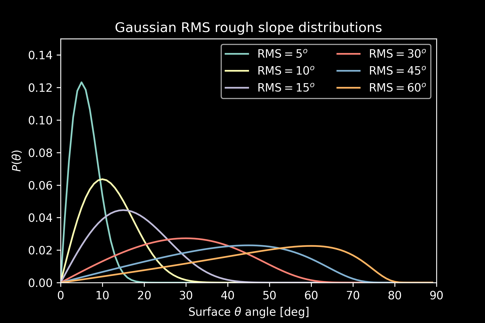
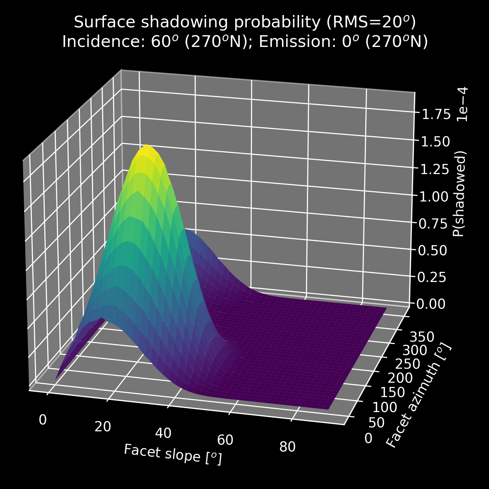

<h1 align="center">Roughness</h1>

<div align="center">
  <strong>Illumination of rough planetary surfaces.</strong>
</div>

<div align="center">
  <span>
  <!-- PYPI version -->
  <!-- <a href="https://badge.fury.io/py/roughness">
    
  </a> -->
 <!-- Test Coverage -->
  <!-- <a href="https://codecov.io/github/choojs/choo">
    
  </a> -->
  <!-- Zenodo DOI -->
  <a href="https://zenodo.org/badge/latestdoi/328820617">
  <!-- Code Quality and Tests -->
  </a>
  <a href="https://github.com/NAU-PIXEL/roughness/actions/workflows/code_quality_checks.yml">
  <!-- Docs -->
  </a>
  <a href="https://nau-pixel.github.io/roughness/">
  <!-- Code Style Black -->
  </a>
  <a href="https://github.com/psf/black">
  </a>
  </span>
</div>

A python package for predicting the illumination and shadowing conditions on a rough planetary surface.

## Features

- Generate rough surface slope distributions



- Adjust for viewing geometry


- Predict the shadowed fraction of the surface given solar incidence, roughness, and viewing geometry



- Full documentation: [nau-pixel.github.io/roughness](https://nau-pixel.github.io/roughness/)
- Example notebooks coming soon!

## Installation

To clone and run the package, you'll need [Git](https://git-scm.com) and [Poetry](https://python-poetry.org/docs/) installed on your computer.

```bash
# Clone this repository
$ git clone git@github.com:NAU-PIXEL/roughness.git

# Enter the repository
$ cd roughness

# Install dependencies into a venv with poetry
$ poetry install

# Run setup script (may take awhile)
$ poetry run python setup_roughness.py

# Now you can open a Jupyter server...
$ poetry run python jupyter notebook

# or activate the venv directly from the terminal...
$ poetry shell
$ python

# or activate the venv from your favorite IDE
# The venv is located at ~/roughness/.venv/bin/python
```

## Updating to the latest version

## Contribute

This package is a work in progress. We appreciate any and all contributions in the form of bug reports & feature requests on our [issues](https://github.com/NAU-PIXEL/roughness/issues) page, or as pull requests (see [contributing guide](https://github.com/NAU-PIXEL/roughness/tree/main/CONTRIBUTING.md) for more details).

## Credits

This package is adapted from code by the late Dr. J. L. Bandfield. You can read more about the first iterations of this code in [Bandfield et al. (2015)](https://doi.org/10.1016/j.icarus.2014.11.009) and [Bandfield et al. (2018)](https://doi.org/10.1038/s41561-018-0065-0).

This package was created with [Cookiecutter](https://github.com/audreyr/cookiecutter) and the [`mgancita/cookiecutter-pypackage`](https://mgancita.github.io/cookiecutter-pypackage/) project template.

## License

[MIT](https://github.com/NAU-PIXEL/roughness/tree/main/LICENSE). Learn more [here](https://tldrlegal.com/license/mit-license).

Copyright (c) 2021, Christian J. Tai Udovicic

---

> CV [cjtu.github.io](https://cjtu.github.io) &nbsp;&middot;&nbsp;
> GitHub [@cjtu](https://github.com/cjtu) &nbsp;&middot;&nbsp;
> Twitter [@TaiUdovicic](https://twitter.com/TaiUdovicic)
