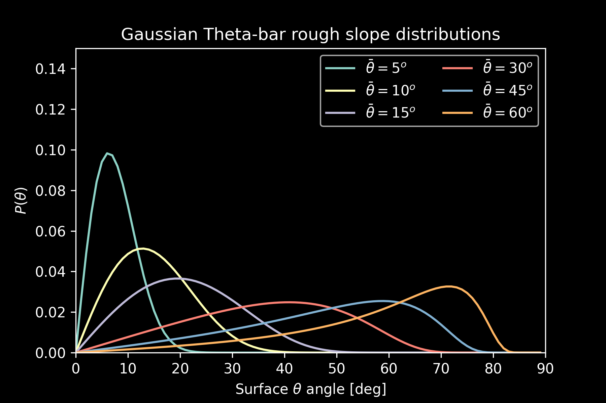

# roughness

Predict illumination of planetary surfaces accounting for roughness.

## Types of roughness

### Gaussian RMS (Shepard et al., 1995)

RMS roughness is given by equation 13 in Shepard et al. (1995).

$P(\theta) =\frac{tan\theta}{\bar{tan\theta}^2} exp(\frac{-tan^2 \theta}{2 tan^2 \bar{\theta}})$

### Theta-bar (Hapke, 1984)

Theta-bar roughness is computed using equation 44 in Hapke (1984). It is given by:

$P(\theta) = A sec^2 \theta \ sin \theta \ exp(-tan^2 \theta / B tan^2 \bar{\theta})$

Where $A = \frac{2}{\pi tan^2 \bar{\theta}}$, and $B = \pi$. This reduces to:

$P(\theta) = \frac{2}{\pi tan^2 \bar{\theta}} \ sec^2 \theta \ sin \ \theta \ exp(\frac{-tan^2 \theta}{\pi tan^2 \bar{\theta}})$

$P(\theta) = \frac{2sin \theta}{\pi tan^2 \bar{\theta} \ cos^2 \theta} \ exp(\frac{-tan^2 \theta}{\pi tan^2 \bar{\theta}})$

## Accounting for viewing angle

The emission angle and azimuth the surface is viewed from will change the distribution of slopes observed. 

For example, when viewed from the North (azimuth=0$^o$) and an emission angle of 30$^o$, we expect to see more North facing slopes than South facing, with the difference being more pronounced at higher roughness values.

